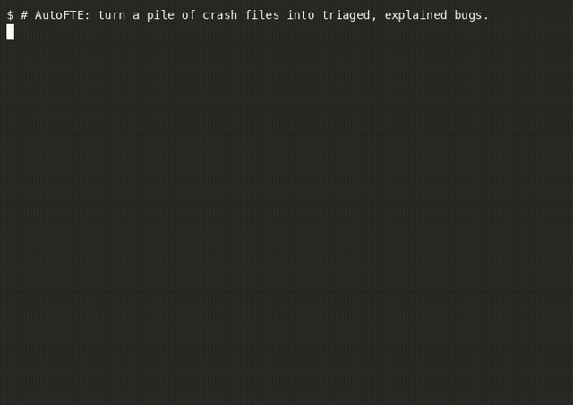

<div align="center">


# AutoFTE

**Local-first crash triage, binary mitigation analysis, and LLM-assisted write-ups for fuzzing runs.**

[](https://pypi.org/project/autofte/)
[](https://www.python.org/)
[](https://pypi.org/project/autofte/)
[](LICENSE)
[](tests/)

[](https://www.python.org/)
[](https://en.wikipedia.org/wiki/C%2B%2B)
[](https://github.com/google/sanitizers)
[](https://github.com/AFLplusplus/AFLplusplus)
[](https://www.sourceware.org/gdb/)
[](https://www.gnu.org/software/binutils/)
[](https://ollama.com/)
[](https://docs.oasis-open.org/sarif/sarif/v2.1.0/sarif-v2.1.0.html)
[](Dockerfile)
[](action.yml)

</div>

---

## Overview

Fuzzing campaigns often yield hundreds or thousands of crash artifacts that share underlying root causes. **AutoFTE** automates post-fuzzing triage entirely on your local machine:

1. **Deduplicates crashes** into root-cause buckets using AddressSanitizer (ASan), UndefinedBehaviorSanitizer (UBSan), LeakSanitizer (LSan), MemorySanitizer (MSan), ThreadSanitizer (TSan), or GDB backtraces with ASLR-shift-normalized stack hashing.
2. **Audits binary defenses** (NX, PIE, RELRO, stack canaries, FORTIFY_SOURCE, unsafe libc calls) to profile target exploit mitigations.
3. **Assesses exploit difficulty** by fusing fault mechanics with active mitigations into an evidence-backed difficulty rating, confidence score, and clear rationale.
4. **Generates grounded write-ups** using an optional local Ollama LLM with schema-constrained, evidence-ledgered prompts to prevent hallucination.
5. **Exports multi-format artifacts** including a self-contained static HTML dashboard, SARIF v2.1.0 logs for GitHub Code Scanning, and Markdown run summaries.

AutoFTE runs completely offline. No crash data, binaries, or source code ever leave your environment.

<div align="center">
  
</div>

---

## Key Capabilities

| Capability | Technical Implementation |
|---|---|
| **Deterministic Crash Deduplication** | Groups crashes using major/minor stack-hash algorithms. Extracts bug classes, read/write access types, access sizes, fault addresses, and alloc/free stacks from ASan/UBSan/LSan/MSan/TSan reports. Falls back to GDB backtraces or exit-signal bucketing when sanitizer metadata is absent. |
| **Binary Mitigation Scanning** | Inspects ELF binaries using standard binutils (`readelf`, `objdump`, `nm`, `ldd`, `file`, `strings`) to audit NX, PIE, Full/Partial RELRO, Stack Canaries, FORTIFY_SOURCE, and unsafe C library symbols (`strcpy`, `gets`, `sprintf`). |
| **Context-Aware Exploit Severity** | Evaluates exploit difficulty (`Easy`, `Medium`, `Hard`, `Unknown`) with explicit confidence scores and justification strings based on the intersection of fault type and binary mitigations. |
| **Grounded Local LLM Summaries** | Invokes local Ollama models via strict JSON schema constraints and a 6-stage deterministic validator pipeline to summarize root causes, suggest verification checks, and draft fixes without ungrounded claims. Skips cleanly if Ollama is unavailable. |
| **Static Dashboard & SARIF Export** | Builds a zero-dependency static HTML dashboard (`dashboard/index.html`) with interactive details, collapsible stack traces, and mitigation summaries. Emits OASIS SARIF v2.1.0 findings for CI/CD code scanning. |
| **Empirically Benchmarked Accuracy** | Evaluated against the standard GPTrace/Igor benchmark (325,044 ground-truth ASan crash reports across 14 C/C++ targets) with published macro and pooled micro purity metrics. |
| **Environment Diagnostic Utility** | Built-in `autofte doctor` audits your system for required binutils tools and optional debuggers, fuzzers, and LLM backends. |

---

## Comparison Matrix

| Feature | Manual GDB Loop | GDB `exploitable` Plugin | CASR | AutoFTE |
|---|---|---|---|---|
| **Setup Complexity** | Manual | Requires GDB + Python plugin | Rust toolchain, Docker, ptrace caps | Single command (`pipx install autofte`) |
| **Root-Cause Deduplication** | Manual inspection | Single crash at a time | Major/minor stack hashing | Major/minor stack hashing with ASLR normalization |
| **Sanitizer Report Parsing** | Manual reading | No | Yes | Yes (ASan, UBSan, LSan, MSan & TSan normalized records) |
| **Mitigation & Severity Scoring** | Manual assessment | Basic heuristics | Rule-based triage | Fused crash fault + binary defense severity scoring |
| **Plain-Language Write-Ups** | None | None | None | Local LLM summaries grounded in crash evidence |
| **SARIF / CI Code Scanning** | None | None | Yes | Native SARIF v2.1.0 output & GitHub Action |
| **Data Privacy** | Local | Local | Local | 100% Local (no cloud telemetry or off-box calls) |

---

## Empirical Benchmark Accuracy

AutoFTE deduplication accuracy is measured against the published [GPTrace / Igor ground-truth benchmark](https://zenodo.org/records/18708473) (325,044 labeled ASan reports across 50 real bugs and 14 C/C++ targets). Run `autofte bench --corpus igor` to reproduce locally (`scripts/fetch_bench_corpus.sh` downloads and verifies the corpus).

| Metric | Crashwalk (Published) | GPTrace (Published) | AutoFTE (Macro Mean) | AutoFTE (Pooled Micro) |
|---|---|---|---|---|
| **Purity** | 98.0% | 98.0% | **97.7%** | **89.9%** |
| **Inverse Purity** | 69.0% | 94.0% | **90.5%** | **80.3%** |
| **F-Measure** | 76.0 | 94.0 | **91.9%** | **78.3%** |

- **Purity** measures whether distinct bugs are kept in separate buckets (preventing silent merging).
- **Inverse Purity** measures whether reports from the same bug remain grouped rather than fragmented into redundant buckets.
- **Pooled Micro Purity (89.9%)** reaches the theoretical ceiling (89.4%) achievable with stack-hash signals on this dataset, as calculated by [`scripts/purity_ceiling.py`](scripts/purity_ceiling.py).
- Detailed per-target breakdowns and benchmark history are documented in [`benchmarks/results.md`](benchmarks/results.md).

---

## Installation & Prerequisites

### Prerequisites

AutoFTE requires Linux and Python 3.9+.

- **Required System Tools:** `readelf`, `objdump`, `nm`, `ldd`, `file`, `strings` (provided by `binutils` and system utilities).
- **Optional Tools:** `gdb` (for non-sanitizer backtraces), `checksec`, `afl-fuzz` / `afl-cmin` (for fuzzing campaigns), and `ollama` (for local LLM write-ups).

Verify installed tools using:

```bash
autofte doctor
```

### 1. Install via PyPI (Recommended)

```bash
pipx install autofte
# or
pip install autofte
```

### 2. Standalone Binary

Pre-compiled single-file x86_64 Linux executables are attached to each [GitHub Release](https://github.com/Nathan-Luevano/AutoFTE/releases):

```bash
curl -sSL -o autofte https://github.com/Nathan-Luevano/AutoFTE/releases/download/v0.3.0/autofte-linux-x86_64
chmod +x autofte
sudo mv autofte /usr/local/bin/
```

### 3. Install from Source

```bash
git clone https://github.com/Nathan-Luevano/AutoFTE.git
cd AutoFTE
python3 -m pip install -e .
```

Or using Conda / Micromamba (which includes `gdb` and `binutils`):

```bash
micromamba create -f environment.yml
micromamba activate autofte
```

### 4. Docker Container

```bash
git clone https://github.com/Nathan-Luevano/AutoFTE.git
cd AutoFTE
docker build -t autofte .
docker run --rm autofte demo
```

---

## Quick Start

### 1. Zero-Setup Demo

Execute the end-to-end demo without configuring targets or fuzzer runs. AutoFTE builds the bundled vulnerable target (`examples/vuln-demo`), triages 12 pre-seeded crashes across four distinct vulnerability classes (stack overflow, heap overflow, use-after-free, and NULL pointer dereference), inspects binary protections, and generates full reports:

```bash
autofte demo
```

Run with `--verbose` to view the full pipeline trace:

```bash
autofte demo --verbose
```

Artifacts are written to `./autofte-demo-output/`.

### 2. Triage Your Own Fuzzing Campaign

To triage crashes generated by AFL++, libFuzzer, or custom harnesses:

```bash
autofte pipeline ./path/to/target_binary ./path/to/source.c --crashes-dir ./out/default/crashes
```

### Output Artifacts

The pipeline generates the following files in the target output directory:

- `crash_triage.json`: Structured deduplication record grouping crashes by major/minor stack hashes, bug classes, and reproducibility stats.
- `binary_analysis.json`: Binary mitigation posture (NX, PIE, RELRO, Canaries, FORTIFY_SOURCE, unsafe functions).
- `llm_analysis.json`: Evidence-grounded root-cause write-up, verification checks, and remediation suggestions.
- `analysis_summary.md`: Human-readable Markdown summary report.
- `dashboard/index.html`: Self-contained static HTML dashboard with collapsible crash groups and mitigation statistics.
- `findings.sarif`: OASIS SARIF v2.1.0 log for CI/CD and GitHub Code Scanning (when `--sarif` is provided).
- `summary.json`: Consolidated machine-readable summary with severity-ranked crash groups, binary posture, and LLM notes (when `--summary-json` is provided).

---

## CLI Reference

AutoFTE provides a modular command-line interface. Each pipeline stage can be executed independently.

```bash
autofte [COMMAND] [OPTIONS]
```

### Subcommand Overview

| Command | Usage | Description |
|---|---|---|
| `demo` | `autofte demo [options]` | Builds and triages the bundled 4-bug demo target in one command. |
| `pipeline` | `autofte pipeline [binary] [source] [options]` | Runs triage, binscan, LLM analysis, markdown report, and dashboard in sequence. |
| `triage` | `autofte triage [options]` | Groups crash files by root cause and writes `crash_triage.json`. |
| `binscan` | `autofte binscan <binary> [options]` | Audits binary exploit mitigations and writes `binary_analysis.json`. |
| `llm` | `autofte llm [options]` | Generates local LLM summary from triage and binscan artifacts. |
| `report` | `autofte report [options]` | Compiles Markdown (`analysis_summary.md`), SARIF, or a consolidated JSON summary (`--format json`) from JSON artifacts. |
| `summary` | `autofte summary [options]` | Prints a severity-ranked crash-group table, or writes JSON/CSV with `--format`, from analysis artifacts. |
| `dashboard` | `autofte dashboard [options]` | Renders the static HTML dashboard from JSON artifacts. |
| `crash-info` | `autofte crash-info [file]` | Inspects file size, type, and hex preview of a single crash payload. |
| `doctor` | `autofte doctor [options]` | Audits system dependencies and reporting tool availability (`--json` for machine-readable output). |
| `bench` | `autofte bench [options]` | Evaluates deduplication accuracy against labeled ground-truth datasets. |

### Command Options

#### `autofte demo`
- `--demo-dir PATH`: Custom demo directory (defaults to bundled `examples/vuln-demo`).
- `--output-dir DIR`: Directory for generated artifacts (default: `./autofte-demo-output`).
- `--model MODEL`: Name of local Ollama model (auto-detected if omitted).
- `--host URL`: Ollama host URL (default: `$OLLAMA_HOST` or `http://localhost:11434`).
- `--llm-timeout SEC`: Inference timeout in seconds.
- `--verbose`: Print full pipeline progress output.

#### `autofte pipeline`
- `target_binary`: Path to target executable (default: `./target`).
- `source_file`: Path to primary C/C++ source file (default: `vuln.c`).
- `--crashes-dir DIR`: Directory containing crash inputs (default: auto-detected in `out/default/crashes`, `out/crashes`, or `crashes`).
- `--debugger {gdb}`: Debugger backend (default: `gdb`).
- `--reproduction-runs N`: Times to re-run each crashing input to gauge reproducibility (default: 5; `1` disables verification for speed).
- `--model MODEL`: Ollama model name.
- `--host URL`: Ollama host URL.
- `--llm-timeout SEC`: Ollama request timeout in seconds.
- `--skip-llm`: Skip the LLM write-up phase entirely.
- `--sarif PATH`: Write OASIS SARIF v2.1.0 log to specified path.
- `--summary-json PATH`: Write a consolidated JSON summary (severity-ranked crash groups, binary posture, LLM notes) to specified path.
- `--fail-on-difficulty {easy,medium,hard}`: Exit non-zero (code 2) if any crash group is at or above this exploit difficulty — a CI gate for fuzzing pipelines.
- `--quiet`: Suppress per-file progress output.

#### `autofte triage`
- `--target-binary PATH`: Path to target binary (default: `./target`).
- `--crashes-dir DIR`: Directory of crash files to triage.
- `--output PATH`: Path for output JSON (default: `crash_triage.json`).
- `--debugger {gdb}`: Debugger backend (default: `gdb`).
- `--reproduction-runs N`: Times to re-run each crashing input to gauge reproducibility (default: 5; `1` disables verification for speed).
- `--quiet`: Suppress per-file progress output.

#### `autofte binscan`
- `binary`: Path to target ELF binary (positional, required).
- `-o, --output PATH`: Path for output JSON (default: `binary_analysis.json`).

#### `autofte bench`
- `--corpus {micro,igor,<path>}`: Ground-truth benchmark dataset to evaluate (default: `micro`).
- `--per-target`: Print detailed metrics table for each target individually (for `igor` corpus).
- `--baseline PATH`: Path to a `bench-results.json` to diff against.
- `--json PATH`: Export full benchmark metrics to JSON.
- `--csv PATH`: Export the per-target metrics table as CSV (igor corpus only).
- `--fail-under-f FLOAT`: Exit non-zero if F-measure falls below this threshold.
- `--fail-purity-drop FLOAT`: Exit non-zero if purity drops by more than this percentage against baseline (default: `2.0`).

---

## Configuration & Environment Variables

AutoFTE can be configured using command-line arguments or environment variables:

| Environment Variable | CLI Flag Equivalent | Default Value | Description |
|---|---|---|---|
| `OLLAMA_HOST` | `--host` | `http://localhost:11434` | Endpoint for the local Ollama API service. |
| `AUTOFTE_LLM_MODEL` | `--model` | Auto-detected | Preferred local LLM model (prioritizes installed models containing `coder`). |
| `AUTOFTE_LLM_TIMEOUT` | `--llm-timeout` | None (unbounded) | Maximum time in seconds to wait for LLM response. |

---

## Python API Usage

AutoFTE modules can be imported and integrated directly into Python scripts and workflows:

```python
from autofte.triage import triage_crashes
from autofte.binary_analysis import analyze_binary
from autofte.severity import assess_crash_difficulty
from autofte.crash_display import representative_crash_record
from autofte.report import build_report
from autofte.dashboard import build_html
from autofte.sarif import dump_sarif

# 1. Triage crashes and deduplicate by stack hash
triage_result = triage_crashes(
    crashes_dir="examples/vuln-demo/crashes",
    target_binary="examples/vuln-demo/target_asan",
    debugger="gdb",
    reproduction_runs=5,
)

print(f"Total Crashes: {triage_result['total_crashes']}")
print(f"Unique Bug Groups: {triage_result['unique_crash_frames']}")

# 2. Inspect binary exploit mitigations
binary_data = analyze_binary("examples/vuln-demo/target_asan")

# 3. Assess severity for the primary crash group
top_group = next(iter(triage_result["groups"].values()))
crash_record = representative_crash_record(top_group)
severity_assessment = assess_crash_difficulty(binary_data, crash_record)

print(f"Difficulty: {severity_assessment['difficulty']}")
print(f"Confidence: {severity_assessment['confidence']:.2f}")
print(f"Rationale: {severity_assessment['rationale']}")

# 4. Generate Markdown summary, HTML dashboard, and SARIF log
markdown_report = build_report(
    target_binary="examples/vuln-demo/target_asan",
    source_file="examples/vuln-demo/vuln.c",
    triage=triage_result,
    binary_data=binary_data,
    llm_data=None,
)

html_dashboard = build_html(
    triage=triage_result,
    binary_data=binary_data,
    llm_data=None,
)

sarif_json = dump_sarif(
    triage=triage_result,
    binary_data=binary_data,
    llm_data=None,
    target_binary="examples/vuln-demo/target_asan",
)
```

---

## CI/CD & GitHub Actions

AutoFTE provides a reusable composite GitHub Action (`action.yml`) to triage fuzzing crashes and upload SARIF findings to GitHub Code Scanning.

```yaml
name: "Continuous Fuzzing & Triage"

on:
  workflow_dispatch:
  schedule:
    - cron: "0 2 * * *"

jobs:
  fuzz-and-triage:
    runs-on: ubuntu-latest
    permissions:
      contents: read
      security-events: write

    steps:
      - name: Checkout Repository
        uses: actions/checkout@v4

      - name: Build Target & Run Fuzzing
        run: |
          make -C examples/vuln-demo target_asan
          # Run fuzzer (e.g., AFL++, libFuzzer)

      - name: Triage Crashes with AutoFTE
        id: autofte
        uses: Nathan-Luevano/AutoFTE@v0.3.0
        with:
          target-binary: "./examples/vuln-demo/target_asan"
          source-file: "examples/vuln-demo/vuln.c"
          crashes-dir: "out/default/crashes"
          sarif-output: "findings.sarif"
          upload-sarif: "true"

      - name: Print Results
        run: |
          echo "Total crashes: ${{ steps.autofte.outputs.total-crash-count }}"
          echo "Unique root causes: ${{ steps.autofte.outputs.unique-crash-count }}"
```

See [`.github/workflows/example-fuzzing-triage.yml`](.github/workflows/example-fuzzing-triage.yml) for a complete reference workflow.

---

## Fuzzing Helpers

AutoFTE includes helper utilities in `scripts/` to streamline AFL++ fuzzing and crash minimization:

```bash
# Run AFL++ fuzzing campaign
scripts/fuzz.sh examples/vuln-demo/target examples/vuln-demo/in out

# Minimize crash corpus with afl-cmin
scripts/minimize.sh examples/vuln-demo/target out/default/crashes out/default/crashes_min
```

---

## Repository Architecture

```
AutoFTE/
├── autofte/                 # Core Python package
│   ├── cli.py               # CLI command definitions, argument parsing, and handlers
│   ├── triage.py            # Crash reproduction and deduplication orchestrator
│   ├── dedup.py             # Major and minor stack hashing algorithms
│   ├── sanitizers.py        # ASan, UBSan, LSan, MSan, TSan output parsers and normalizers
│   ├── binary_analysis.py   # ELF binary security feature inspection
│   ├── severity.py          # Crash-aware exploit difficulty and severity scoring
│   ├── llm.py               # Local Ollama client, evidence ledger, and validators
│   ├── sarif.py             # OASIS SARIF v2.1.0 report exporter
│   ├── report.py            # Markdown summary generator and terminal formatter
│   ├── dashboard.py         # Static HTML/CSS/JS dashboard generator
│   ├── doctor.py            # Environment diagnostics and toolchain verification
│   ├── bench.py             # Ground-truth accuracy benchmark runner
│   ├── metrics.py           # Purity, inverse purity, and F-measure computations
│   ├── config.py            # Environment variables and configuration management
│   ├── io_utils.py          # Standardized JSON file reading and writing
│   ├── paths.py             # Default crash directory discovery
│   ├── crash_display.py     # Representative crash extraction and label formatting
│   ├── vendored_ignore_lists.py # Stack noise filter rules from ClusterFuzz / CASR
│   └── demo_assets/         # Packaged demo target for standalone execution
├── benchmarks/              # Benchmark baseline datasets and evaluation results
├── examples/                # Example vulnerable targets and crash corpuses
├── scripts/                 # Fuzzing wrappers, smoke tests, and benchmark helpers
├── tests/                   # Pytest test suite (unit, integration, and E2E)
├── action.yml               # GitHub Action definition
├── Dockerfile               # Container build recipe
├── pyproject.toml           # Package metadata, dependencies, and entrypoints
└── README.md                # Project documentation
```

---

## Development & Testing

### Development Setup

```bash
git clone https://github.com/Nathan-Luevano/AutoFTE.git
cd AutoFTE
python3 -m pip install -e ".[dev]"
```

### Running Tests and Linters

Execute the pytest suite:

```bash
pytest
```

Run code style and lint checks:

```bash
ruff check .
```

Run the end-to-end CLI smoke test against compiled binaries:

```bash
scripts/smoke-test.sh
```

---

## Security & Privacy

- **Zero Cloud Data Transfer:** AutoFTE executes all triage, deduplication, binary analysis, and severity scoring locally.
- **Local Model Execution:** The LLM summarization step communicates strictly with your local Ollama instance (or user-specified host). No crash payloads, binaries, or source files are transmitted to external services.
- **Vulnerability Disclosure:** Please review our [Security Policy](SECURITY.md) for reporting guidelines.

---

## Contributing

Contributions are welcome. Please refer to [CONTRIBUTING.md](CONTRIBUTING.md) for development workflows, coding standards, and pull request guidelines.

---

## License

This project is licensed under the [MIT License](LICENSE).
