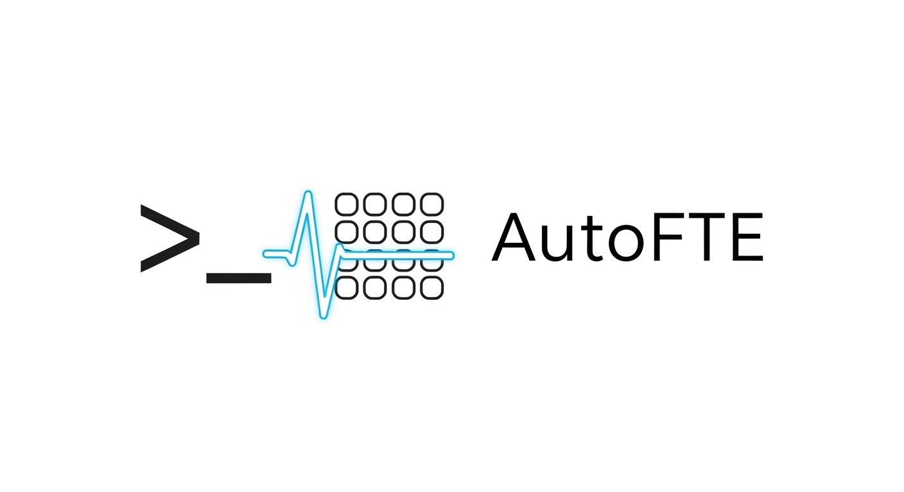

# AutoFTE



AutoFTE turns a pile of AFL++ crash files into a readable answer to "what probably broke and how bad is it." It groups crashes by root cause, checks the target binary's exploit mitigations, and (optionally) asks a local LLM via [Ollama](https://ollama.com) for a plain-language write-up — all offline, all on your machine.

It started as a weekend fuzzing/triage script. It's now an installable CLI with a real test suite, and the goal is to keep growing it toward genuinely useful crash-triage tooling — not just a toy.

## What it does

- **Triage** — groups crash files by gdb backtrace frame (or by exit signal if gdb isn't available) so you're not looking at 500 crashes one at a time.
- **Binscan** — checks the target for NX, PIE, RELRO, stack canaries, FORTIFY_SOURCE, and dangerous libc calls, then estimates how hard the bug would be to exploit.
- **LLM notes** *(optional)* — asks a local Ollama model to summarize the run and suggest fix ideas. Never sends anything off your machine, and the pipeline works fine without it.
- **Report + dashboard** — a markdown summary and a static HTML dashboard you can open in a browser or drop in CI artifacts.

## Install

```bash
git clone https://github.com/<you>/AutoFTE.git
cd AutoFTE
python3 -m pip install -e .
```

Or with conda/micromamba (also pulls in gdb/binutils):

```bash
micromamba create -f environment.yml
micromamba activate autofte
```

Then check what your machine actually has available:

```bash
autofte doctor
```

`readelf`, `objdump`, `nm`, `ldd`, `file`, and `strings` are required for binary analysis. `gdb`, `checksec`, and AFL++ are optional — everything degrades gracefully without them.

## Quick start with the bundled demo target

```bash
make -C examples/vuln-demo
mkdir -p out/default/crashes && cp examples/vuln-demo/in/seed1 out/default/crashes/  # or run a real AFL++ session

autofte pipeline examples/vuln-demo/target examples/vuln-demo/vuln.c
```

Outputs land in the repo root: `crash_triage.json`, `binary_analysis.json`, `llm_analysis.json` (if Ollama is reachable), `analysis_summary.md`, and `dashboard/index.html`.

## CLI

Every step also runs standalone:

| Command | What it does |
|---|---|
| `autofte triage` | Group crash files by frame/signal → JSON |
| `autofte binscan <binary>` | Exploit mitigation report → JSON |
| `autofte llm` | Local-LLM write-up from the triage + binscan output |
| `autofte report` | Markdown summary from the JSON artifacts |
| `autofte dashboard` | Static HTML dashboard from the JSON artifacts |
| `autofte crash-info [file]` | Quick size/type/preview of one crash file |
| `autofte doctor` | Report which required/optional tools are installed |
| `autofte pipeline [binary] [source]` | Runs all of the above in order |

Run `autofte <command> --help` for the full flag list.

## Fuzzing helpers

`scripts/fuzz.sh` and `scripts/minimize.sh` are thin wrappers around `afl-fuzz` and `afl-cmin` — AutoFTE doesn't reimplement a fuzzer, it consumes AFL++'s output.

```bash
scripts/fuzz.sh examples/vuln-demo/target examples/vuln-demo/in out
scripts/minimize.sh examples/vuln-demo/target out/default/crashes out/default/crashes_min
```

## Choosing an LLM model

There's no hard-coded default model — different machines have different models pulled. AutoFTE resolves one at runtime, in order:

1. `--model` flag
2. `AUTOFTE_LLM_MODEL` environment variable
3. auto-detect: pick an installed Ollama model with "coder" in the name (falls back to whatever's installed first)

```bash
autofte llm --model qwen3-coder:30b
# or
export AUTOFTE_LLM_MODEL=qwen3-coder:30b
```

`OLLAMA_HOST` (or `--host`) controls where AutoFTE looks for Ollama; defaults to `http://localhost:11434`.

## Repo layout

```
autofte/            the installable package (triage, binary_analysis, llm, report, dashboard, cli)
examples/vuln-demo/  intentionally vulnerable demo target + Makefile + seed corpus
scripts/             thin AFL++ wrappers (fuzz.sh, minimize.sh)
tests/               pytest suite
```

## Development

```bash
python3 -m pip install -e ".[dev]"
pytest
ruff check .
```

See [CONTRIBUTING.md](CONTRIBUTING.md).

## Roadmap

- Support fuzzer backends beyond AFL++ (libFuzzer, honggfuzz)
- Pluggable analysis backends (angr/radare2 checks alongside static mitigation checks)
- Exportable, structured findings (SARIF) for CI pipelines
- A real crash-similarity metric beyond "same top frame" (stack hash, coverage-based clustering)

## Notes

- Standard binutils tools (`readelf`, `objdump`, `nm`, `ldd`, `file`, `strings`) are required for binary analysis; run `autofte doctor` to check.
- `gdb` and AFL++ are optional. If `gdb` is missing, crash grouping falls back to signal-based buckets.
- Ollama is optional; if it's not running, the rest of the pipeline still finishes.
